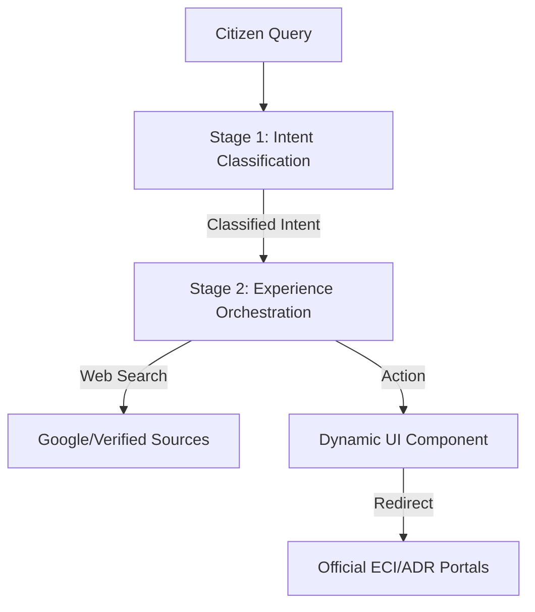

# Praja Vidhya: Election Intelligence & Education Platform

Praja Vidhya is a modular, AI-driven platform designed to empower Indian citizens with trusted election information. It utilizes a sophisticated 2-stage AI pipeline to classify user intent and orchestrate an accessible, trustworthy experience.

## 🚀 Key Features

### 1. 2-Stage AI Pipeline
- **Stage 1 (Intent Classification)**: Analyzes citizen queries and maps them to specific UI modules (Voter Dashboard, Candidate Intelligence, Fact Checking, etc.).
- **Stage 2 (Experience Orchestrator)**: Assigns deterministic actions, performs web searches for educational topics, and generates neutral, safe responses.

### 2. Location-Aware Booth Finder
- Interactive polling booth locator with distance calculation.
- Supports both GPS auto-detection and manual landmark entry.

### 3. Dynamic Micro-Learning & Search
- Integrated search logic for educational topics like **NOTA**, **EVM Security**, and **Model Code of Conduct**.
- Fetches "probable answers" from verified official sources and search engines.

### 4. Voting Awareness Quiz
- Gamified 5-question quiz to test civic knowledge.
- Performance-based badges: *Voting Expert*, *Informed Citizen*, and *Keep Learning*.

### 5. Trustworthy "Government-Grade" UI
- High-contrast, mobile-first design optimized for accessibility and low-literacy users.
- Clean aesthetics using a professional Deep Blue and Green color palette.

---

## 🛠️ Tech Stack

- **Frontend**: [Next.js 15](https://nextjs.org/) (App Router, TypeScript)
- **Styling**: Vanilla CSS (High Performance, No-Tailwind)
- **Icons**: [Lucide React](https://lucide.dev/)
- **AI Layer**: Simulated Gemini 1.5 Pipeline (Ready for Firebase Functions integration)
- **Data Sources**: Election Commission of India (ECI) & ADR (Association for Democratic Reforms)

---

## 🏗️ Architecture



---

## 💻 Getting Started

### Prerequisites
- Node.js 18.x or higher
- npm or yarn

### Installation
1. Clone the repository:
   ```bash
   git clone https://github.com/balachandarchinta/Praja-Vidhya.git
   ```
2. Navigate to the web directory:
   ```bash
   cd Praja-Vidhya/web
   ```
3. Install dependencies:
   ```bash
   npm install
   ```
4. Start the development server:
   ```bash
   npm run dev
   ```
5. Open [http://localhost:3000](http://localhost:3000) in your browser.

---

## 🛡️ Safety & Neutrality Guardrails
- **Hallucination Guard**: Stage 2 is constrained to verified datasets; it never invents candidate facts.
- **Ambiguity Filter**: Mixed or vague queries are blocked from action routing and prompted for clarification.
- **Neutral Voice**: All generated responses follow a strict unbiased tone, especially regarding candidate comparisons.

---

## 📄 License
This project is licensed under the MIT License - see the LICENSE file for details.
